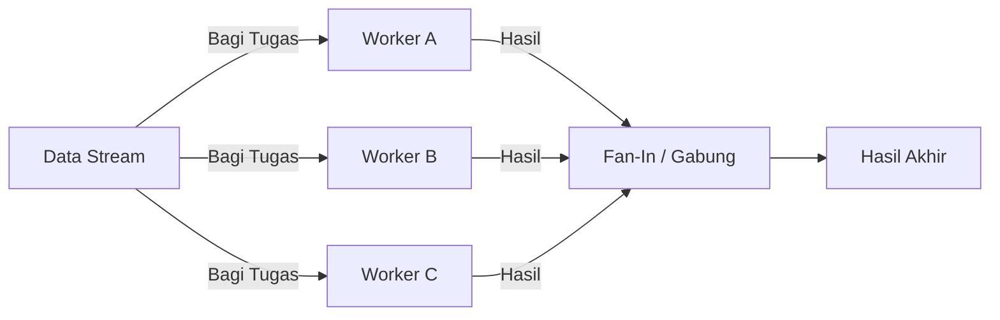
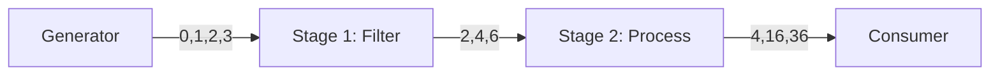

# Pola-Pola Concurrency di Go (Selain Worker Pool)

Selain Worker Pool, Go memiliki pattern lain yang sangat powerful untuk menangani data paralel. Berikut adalah penjelasan sangat detail mengenai **Fan-In / Fan-Out** dan **Pipeline**.

---

## 1. Fan-Out & Fan-In (Scatter-Gather)

Pola ini mirip seperti membagi tugas ke banyak orang, lalu mengumpulkan hasilnya kembali.

### Konsep Visual

### Penjelasan Detail

1.  **Fan-Out (Menyebar)**: 
    -   Kita memiliki 1 channel input tapi dibaca oleh **banyak goroutine** sekaligus.
    -   Siapa yang cepat, dia yang dapat (`Competing Consumers`).
    -   Tujuannya untuk mempercepat pemrosesan jika input sangat deras.
    
2.  **Fan-In (Mengumpul)**:
    -   Kita memiliki **banyak channel output** (dari worker tadi).
    -   Kita perlu cara untuk "menyatukan" semua channel itu menjadi **satu channel saja** agar mudah dibaca oleh consumer terakhir.
    -   Biasanya menggunakan `sync.WaitGroup` untuk menunggu semua selesai, lalu menutup channel gabungan.

### Implementasi
Lihat file contoh: `test/specific/fan_out_fan_in.go`

---

## 2. Pipeline Pattern

Pipeline adalah pola pemrosesan "estafet". Data mengalir dari satu tahap ke tahap berikutnya. Sangat cocok untuk ETL (Extract, Transform, Load) atau streaming data.

### Konsep Visual

### Penjelasan Detail

1.  **Generator**: Menghasilkan data mentah (misal baca file baris per baris).
2.  **Stages**: Setiap fungsi menerima channel input, memprosesnya, dan mengembalikan channel output baru.
3.  **Independence**: Setiap stage berjalan di **goroutine sendiri**. Jadi Stage 1 bisa terus menghasilkan data baru meskipun Stage 2 sedang sibuk memproses data sebelumnya.

### Perbedaan dengan Worker Pool
-   **Worker Pool**: 1 Tugas yang SAMA dikerjakan banyak orang. (Fokus: Throughput)
-   **Pipeline**: 1 Tugas dibagi menjadi TAHAP-TAHAP berbeda. (Fokus: Flow / Stream)

### Implementasi
Lihat file contoh: `test/specific/pipeline_demo.go`

---

## 3. Kapan Pakai Apa?

| Pola | Deskripsi | Kapan Pakai? |
|------|-----------|--------------|
| **Worker Pool** | N Workers mengerjakan job yang sama. | Mengelola resource (DB conn, API limits), membatasi concurrency. |
| **Fan-Out/In** | Memecah 1 job besar jadi sub-task parallel. | Parallel computing, Image processing (tiap pixel/region), Aggregator service. |
| **Pipeline** | Data diproses bertahap. | Streaming data, video processing, ETL, Log processing. |

---

## Contoh Kasus Fan-Out/Fan-In

Bayangkan Anda membuat **Aplikasi Travel Aggregator** (seperti Traveloka/Tiket.com):
1.  User cari "Jakarta - Bali".
2.  **Fan-Out**: Server Anda menembak API Garuda, Lion Air, dan AirAsia secara **bersamaan** (paralel).
3.  **Fan-In**: Server menunggu respon dari ketiganya, menggabungkan hasilnya jadi satu list harga, lalu urutkan termurah.
4.  Kirim ke user.

Jika pakai *Sequential* (satu-satu), loadingnya akan lama sekali (Garuda selesai -> baru Lion -> baru Airasia). Fan-out membuat total waktu tunggu = waktu maskapai terlambat, bukan total semuanya.
