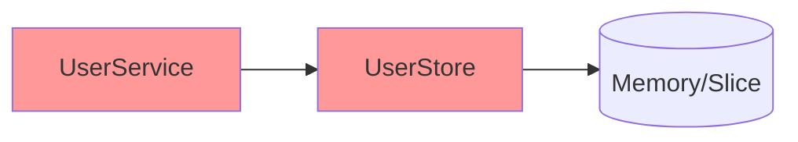
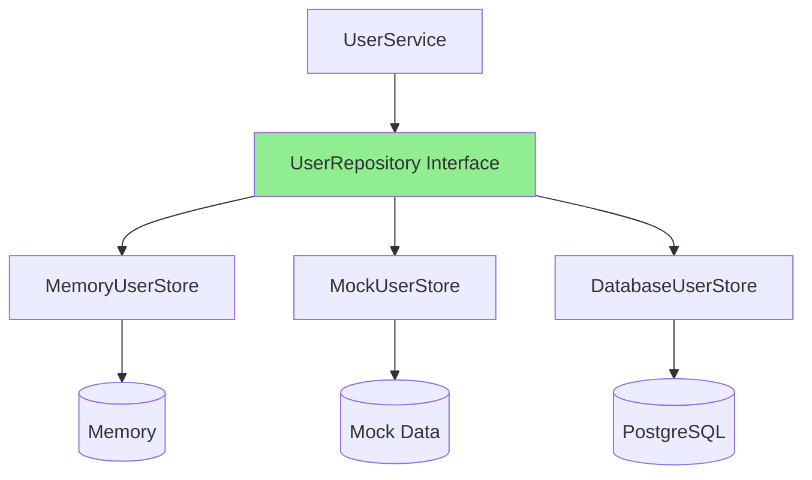

# Interface dalam Go: Perbandingan CRUD Dengan dan Tanpa Interface

## 📋 Daftar Isi
- [Apa itu Interface?](#apa-itu-interface)
- [Case 1: CRUD Tanpa Interface](#case-1-crud-tanpa-interface)
- [Case 2: CRUD Dengan Interface](#case-2-crud-dengan-interface)
- [Perbandingan](#perbandingan)
- [Kapan Menggunakan Interface?](#kapan-menggunakan-interface)

---

## Apa itu Interface?

Interface adalah **kontrak** yang mendefinisikan sekumpulan method signatures. Di Go, interface diimplementasikan secara **implisit** - tidak perlu keyword `implements`.

```go
// Interface = Kontrak
type UserRepository interface {
    Create(name, email string) User
    GetByID(id int) (User, error)
    GetAll() []User
    Update(id int, name, email string) (User, error)
    Delete(id int) error
}
```

Semua struct yang memiliki method di atas otomatis "mengimplementasi" interface tersebut.

---

## Case 1: CRUD Tanpa Interface

📁 [crud_tanpa_interface.go](file:///c:/MyWork/golang/learn-golang-new/test/specific/interface_crud/crud_tanpa_interface.go)

### Struktur Kode



### Implementasi

```go
// Storage langsung dengan struct konkret
type UserStore struct {
    users  []User
    nextID int
}

// Service bergantung LANGSUNG pada struct konkret
type UserService struct {
    store *UserStore  // ❌ Tight coupling!
}

func NewUserService(store *UserStore) *UserService {
    return &UserService{store: store}
}
```

### ⚠️ Masalah

1. **Tight Coupling** - `UserService` terikat ke `UserStore`
2. **Tidak Fleksibel** - Tidak bisa ganti ke database tanpa ubah kode service
3. **Sulit Testing** - Tidak bisa di-mock untuk unit test
4. **Violates SOLID** - Melanggar Dependency Inversion Principle

---

## Case 2: CRUD Dengan Interface

📁 [crud_dengan_interface.go](file:///c:/MyWork/golang/learn-golang-new/test/specific/interface_crud/crud_dengan_interface.go)

### Struktur Kode



### Implementasi

```go
// Definisi Interface (Kontrak)
type UserRepository interface {
    Create(name, email string) User
    GetByID(id int) (User, error)
    GetAll() []User
    Update(id int, name, email string) (User, error)
    Delete(id int) error
}

// Service bergantung pada INTERFACE
type UserService struct {
    repo UserRepository  // ✅ Loose coupling!
}

func NewUserService(repo UserRepository) *UserService {
    return &UserService{repo: repo}
}
```

### Implementasi Berganda

```go
// Implementasi 1: Memory Storage
type MemoryUserStore struct { ... }

// Implementasi 2: Mock (Testing)
type MockUserStore struct { ... }

// Implementasi 3: Database (Production) - bisa ditambah nanti
type DatabaseUserStore struct { ... }
```

### ✅ Keuntungan

1. **Loose Coupling** - Service tidak peduli implementasi konkret
2. **Fleksibel** - Ganti storage tanpa ubah service
3. **Mudah Testing** - Inject mock untuk unit test
4. **SOLID Principle** - Mengikuti Dependency Inversion

---

## Perbandingan

| Aspek | Tanpa Interface | Dengan Interface |
|-------|-----------------|------------------|
| **Coupling** | Tight (❌) | Loose (✅) |
| **Fleksibilitas** | Rendah | Tinggi |
| **Testing** | Sulit | Mudah (mock) |
| **Kompleksitas** | Rendah | Sedikit lebih tinggi |
| **Maintainability** | Sulit | Mudah |
| **Scalability** | Terbatas | Tinggi |

### Visualisasi Perbedaan

````carousel
**Tanpa Interface:**
```
UserService → UserStore → Memory
     │
     └─── TIDAK BISA ganti ke DB tanpa ubah kode!
```
<!-- slide -->
**Dengan Interface:**
```
UserService → UserRepository (interface)
                    │
        ┌───────────┼───────────┐
        ↓           ↓           ↓
   MemoryStore  MockStore  DatabaseStore
        
→ Bisa SWAP implementasi kapanpun!
```
````

---

## Kapan Menggunakan Interface?

### ✅ Gunakan Interface Ketika:

1. **Multiple Implementations** - Ada/akan ada beberapa implementasi
2. **Testing** - Perlu mock untuk unit test
3. **Dependency Injection** - Implementasi ditentukan saat runtime
4. **External Dependencies** - Database, API, file system, dll

### ❌ Tidak Perlu Interface Ketika:

1. **Single Implementation** - Hanya ada satu implementasi selamanya
2. **Simple Application** - Aplikasi sangat sederhana
3. **Internal Components** - Komponen internal yang tidak akan diganti
4. **Over-Engineering** - Menambah kompleksitas tanpa manfaat

---

## 🏃 Cara Menjalankan

```bash
# Jalankan contoh tanpa interface
go run ./test/specific/interface_crud/crud_tanpa_interface.go

# Jalankan contoh dengan interface
go run ./test/specific/interface_crud/crud_dengan_interface.go
```

---

## 💡 Kesimpulan

Interface sangat berguna untuk:
- **Abstraksi** - Menyembunyikan detail implementasi
- **Polymorphism** - Satu interface, banyak implementasi
- **Testing** - Memudahkan mocking
- **Maintainability** - Kode lebih mudah dipelihara

> **Prinsip:** "*Program to an interface, not an implementation*"

Namun, jangan over-engineer. Gunakan interface hanya jika memberikan nilai tambah nyata!
